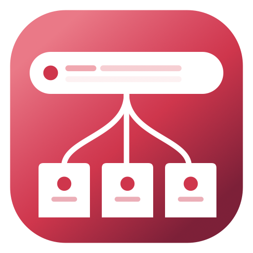

<p align="center">
  
</p>

<h1 align="center">Browser Router</h1>

<p align="center">A macOS app that registers as the default web browser and lets you choose which browser to open URLs in.</p>

## What it does

When a URL is opened on your system, Browser Router intercepts it and shows a floating window with the URL and buttons to open it in any of your installed browsers, or copy it to clipboard.

## Features

- Register as the default web browser on macOS
- Detect installed browsers automatically
- Copy URL to clipboard
- Hide specific browsers from the list
- Configurable UI scale, window size, and URL line limit
- Auto-close after action
- Always-on-top floating window across all spaces

## Install

Download the latest `.app.zip` from [GitHub Releases](https://github.com/LumaKernel/url-catcher/releases), unzip, and move to `/Applications`.

Then open System Settings > Desktop & Dock > Default web browser and select "Browser Router".

Since the app is ad-hoc signed, you may need to right-click > Open on first launch.

## Build from source

```
./build.sh
./install.sh
```

Requires Xcode command line tools and macOS 14+.

## License

[MIT](./LICENSE)
